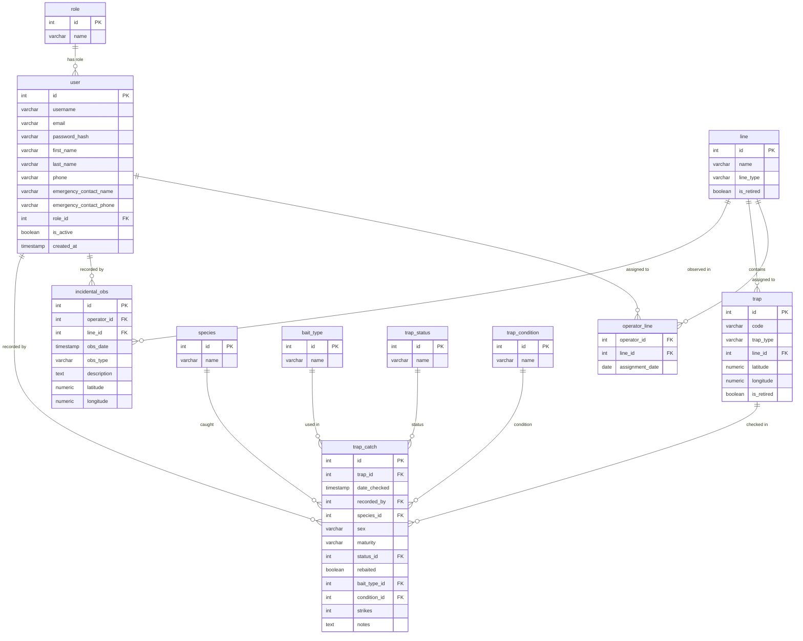

# COMP639 Project 1 — Piwakawaka

A web application for managing predator trap lines and catch records at Lincoln University.

Built with Flask + PostgreSQL, deployed on PythonAnywhere.

**Group:** Piwakawaka
**Course:** COMP639 Studio Project 1, Lincoln University, 2026 S1

---

## Database ERD



---

## Setup and Deployment

### Prerequisites

- Python 3.10+
- PostgreSQL
- pip

### Local Development

1. Clone the repository:
   ```
   git clone https://github.com/COMP639-StudioProjects-26S1/COMP639_Project_1_Piwakawaka.git
   cd COMP639_Project_1_Piwakawaka
   ```

2. Create and activate a virtual environment:
   ```
   python3 -m venv venv
   source venv/bin/activate        # macOS / Linux
   venv\Scripts\activate           # Windows
   ```

3. Install dependencies:
   ```
   pip install -r requirements.txt
   ```

4. Configure the database connection in `piwakawaka/connect.py`:
   ```python
   dbhost = 'localhost'
   dbport = 5432
   dbuser = 'your_db_user'
   dbname = 'your_db_name'
   dbpass = 'your_db_password'
   ```

5. Set up the database:
   ```
   psql -U your_db_user -d your_db_name -f create_db.sql
   psql -U your_db_user -d your_db_name -f populate_db.sql
   ```

6. Run the app:
   ```
   python run.py
   ```

### Deploying to PythonAnywhere

1. Open a Bash console on PythonAnywhere and clone the repository.

2. Create a virtual environment and install dependencies:
   ```
   python3.10 -m venv venv
   source venv/bin/activate
   pip install -r requirements.txt
   ```

3. Update `piwakawaka/connect.py` with the PythonAnywhere PostgreSQL credentials.

4. Set up the database using the PythonAnywhere PostgreSQL console.

5. Configure the web app in the **Web** tab:
   - WSGI file:
     ```python
     from run import app as application
     ```

6. Reload the web app.

### Updating PythonAnywhere (after each push)

```
cd /home/piwakawakaUAT/COMP639_Project_1_Piwakawaka
git pull origin COMP639_Project_1_Piwakawaka_test
```

Then go to the **Web** tab and click **Reload**.

---

## GenAI Acknowledgement

We used Claude Code (Claude Sonnet by Anthropic) during development.

- I asked Claude how `WHERE 1=1` with conditional `AND` clauses works in dynamic SQL — used in the catch records browse page (US15) so filters for line, species, bait type, and date range are only appended when the user actually selects them, avoiding invalid SQL when no filter is active.

- I asked Claude how Bootstrap 5 toasts work and how to create one dynamically in JavaScript — used in `base.html` so success flash messages appear as a bottom-right popup that auto-dismisses after 4 seconds, instead of staying as an inline alert.

- I asked Claude to review the codebase for bugs and it caught that a teammate's route was calling `render_template('lines/add_trap.html')` while the actual file was saved at `templates/admin/add_trap.html` — fixed the path mismatch before it caused a 404 error in production.

- I used Codex to help implement US9 (Retire Lines and Traps), including adding Admin-only retire routes, confirmation prompts, and filtering retired traps from active views so Operators do not see retired traps as active equipment.

- I used Codex to help implement US13 (Add Trap Catch Records), including adding the Operator/Admin add-catch route, assignment-based access control for lines, validation rules for species/strikes and rebaited/bait type, and the new catch-entry form and navigation flow.

- I used Codex to help implement US8 (Edit Lines and Traps), including adding Admin-only edit routes for lines and individual traps, validation for required fields and unique values, and edit options on the admin management and detail pages.

- I asked Claude how to integrate Chart.js with a Flask backend — used in the reports page (US21) to pass server-side query results as JSON to JavaScript, which Chart.js then uses to render bar, horizontal bar, and line charts without page reloads.

- I asked Claude how to build a JavaScript count-up animation — used in the reports hero section so summary stats (total catches, species found, active lines, trap checks) animate from 0 to their real values on page load using `setInterval`.

- I asked Claude how CSS `backdrop-filter: blur()` works for glassmorphism — applied to the navbar to give it a frosted-glass effect when scrolling over page content, using a semi-transparent dark background combined with `blur(14px)`.
